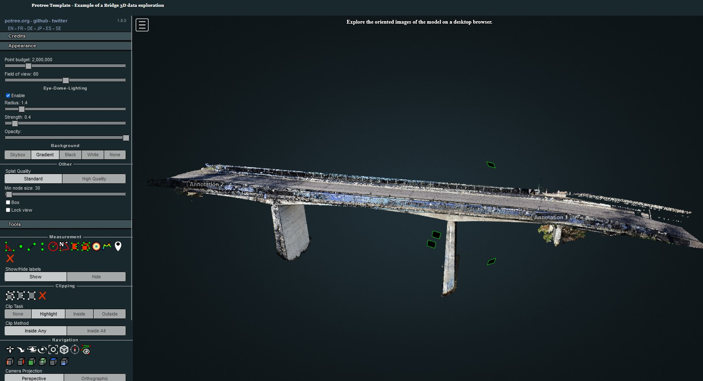
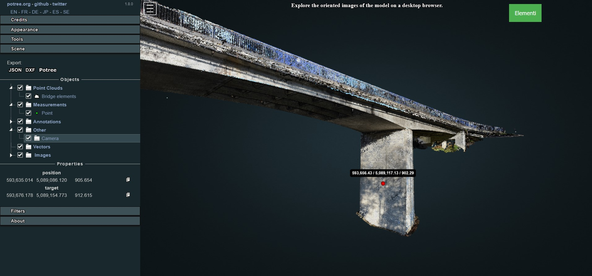

# **PONTI Template**

**Potree platfOrm for iNfrasTructure Inspection** (PONTI) is a custom Potree template for sharing survey products of provincial bridges.

The template is based on the open-source JavaScript library [Potree](https://github.com/potree/potree) by Markus Schütz.



## **About** ℹ

This template aims to simplify the procedure for building Potree-based platform for bridge survey data sharing.

The repository and template has been defined for implementing the following features:

* **Pointcloud visualisation** with both RGB and classification appearance;
* **Oriented images** on the model for direct exploration of drone images used for the reconstruction;
* **Annotations** definition to highlight specific bridge elements, possibly embedding multimedia or actions in their descriptions.

## **Table of contents** 📋

1. **[Getting started](#getting-started)**
2. **[GUI Definition](#gui-definition)**
3. **[Pointclouds integration](#pointcloud-integration)**
4. **[Oriented cameras integration](#oriented-cameras-integration)**
5. **[Annotations integration](#annotations-integration)**
6. **[Extra features](#extra)**

------------------------

## **Getting started** 🛠

To start, sign in [Github](https://github.com/login)
and navigate to the [PONTI GitHub template](https://github.com/labmgf-polimi/ponti),
where you will see a green **Use this template** button.
Click it to open a new page that will ask you for some details:

* Introduce an appropriate "*Repository name*".
* Make sure the project is "*Public*", rather than "*Private*".

After that, click on the green **Create repository from template** button,
which will generate a new repository on your personal account
(or the one of your choosing).

To work locally on the project before loading it to a server, instead click on the **Code** button and then select the *Download ZIP* option. After unzipping the downloaded folder, copy everything in the htdocs folder of the xampp directory of your device for working in your local development environment. 

This repository contains the following files:

***README.md***

Basic description of the repository with instructions on how to replicate the Protree template.

***index.html***

This will be the homepage of the Protree viewer. It contains the basic settings for the GUI and includes the paths to all the style and js files.

***assets***

Decorative images and icons are collected in this folder. Additionally, two others subfolders contain files that are important to define the appearance and the custom functionalities of the viewer:

* *CSS* with the stylesheet in CSS language defined for including in the GUI a header with a description and/or logo.

* *JS* that includes JavaScript files for loading 3D products in the viewer.

***img_selected***

This folder is used to store and collect the oriented images that the viewer developer is willing to integrate on the platform. Together with the picture files, camera certificates and images orientation parameters are saved in this space.

***libs***

All libraries' dependencies for making functionable the viewer are saved in the sub-folders.

***licenses***

License specifications for the used libraries are descripted here.

***pointclouds***

Converted point clouds and ancillary files should be saved in this folder to preserve the template structure.

---------------------

## **GUI definition** 💻

The [index.html](https://github.com/labmgf-polimi/ponti/blob/main/index.html) file includes the main settings for the web page that contains the custom Potree viewer. For example, information contained in this file defines the **title** that will appear on the browser window when the page is loaded as well as other important **metadata** regarding the content and/or the author(s) of the page. These settings are defined in the first lines in the *head* element:

```
...
<head>
	<meta charset="utf-8">
	<meta name="description" content="Bridge digital twin">
	<meta name="author" content="Federica Gaspari">
	<meta name="viewport" content="width=device-width, initial-scale=1.0, user-scalable=no">
	<title>Bridge name</title>
	<link rel="stylesheet" type="text/css" href="./libs/potree/potree.css">
	<link rel="stylesheet" type="text/css" href="./libs/jquery-ui/jquery-ui.min.css">
	<link rel="stylesheet" type="text/css" href="./libs/openlayers3/ol.css">
	<link rel="stylesheet" type="text/css" href="./libs/spectrum/spectrum.css">
	<link rel="stylesheet" type="text/css" href="./libs/jstree/themes/mixed/style.css">
</head>
...
```
When creating a new custom Potree viewer, change the content description according to your need as well as the content author. Then, change the text between the *title* tag by putting the name and/or location of the surveyed bridge. Leave everything else unchanges.

An additional decoration of the main page consist in a banner on the upper part of the window with a custom text and, optionally, a logo. This element require a simple addition to the HTML and CSS page codes to define its content and appearance.


To style the header banner, in the [assets/css/style.css](https://github.com/labmgf-polimi/ponti/blob/main/assets/css/style.css) file the following CSS code is defined:

```
#header_panel {
    width: 100%;
    height: 5%;
    background-color: #19282C;
}

#header_title {
    color: #FFFFFF;
    font-size: 80%;
    font-weight: bold;
    position: relative;
    left: 100px;
    Top: 20px;
    font-family: Georgia, "Times New Roman", Times, serif;
}
```
The *#* simbol before each name allows to define a specific style for specific div elements (through the so called *id*) in the viewer page definition. In particular:

* **header_panel** is set by default as a dark blue-grey (*background-color*) banner whose *width* is always equal to the entire width of a web page in which the viewer is loaded, while its *height* correspond to the 5% of the web page height.

* **header_title** is by default defining a white bold Georgia text (*color*, *font-weight*, *font-family*) whose position always refers to the div element in which it is contained. 

In the [index.html](https://github.com/labmgf-polimi/ponti/blob/main/index.html) file the previously styled header banner is defined in the body section. To change the title to be displayed on the top of the page, simply change the text included within the div *header_title* element. 

```
<!-- Defining header with title -->
	<div id="header_panel">
		<div id="header_title">
			Protree Template - Example of a Bridge 3D data exploration
		</div>
	</div>
```

## **Pointcloud integration** ☁

Before proceeding with this step, make sure you have finished the reconstruction processing of the 3D model of the bridge and obtained a point cloud of the structure in .las format. Once this product is obtained, you could convert the .las cloud using one of the method described in [this documentation of Potree](https://potree-templates.readthedocs.io/en/latest/pages/potree.html#pointcloud-conversion).

As a result, at the end of the procedure you will obtain a folder with the following structure:

```
converted_pointcloud_folder
|
│   hierarchy.bin
│   metadata.json
|	octree.bin    

```

Copy the whole folder and paste it inside the *pointclouds* folder. Then, open the [pointcloud.js](https://github.com/labmgf-polimi/ponti/blob/main/assets/js/pointcloud.js) file with a text editor.

Now you need to refer to the newly converted file in this js code file, enabling its correct visualization in the Potree Viewer. In order to do so, look for the *Loading point cloud data and its setting for rendering in Potree Viewer* comment section in the script.
This part of the file load the pointcloud in json format through the ***loadPointCloud*** function. In order to correctly refer to the newly converted cloud and visualise it in RGB mode, modify the code as below:

```

Potree.loadPointCloud("./pointclouds/converted_pointcloud_folder/metadata.json", "Bridge cloud", e => {
    let pointcloud = e.pointcloud;
    let material = pointcloud.material;
    material.size = 0.6;
    material.pointSizeType = Potree.PointSizeType.ADAPTIVE;
    material.shape = Potree.PointShape.CIRCLE;
    material.activeAttributeName = "rgba"; // change this value to "classification" and uncomment the next 2 lines if you desire to show the classified point cloud
    // material.intensityRange = [1, 100];
    // material.gradient = Potree.Gradients.RAINBOW;
    bridgescene.addPointCloud(pointcloud);
    viewer.setFrontView();
});

```

In this way the cloud will be correctly loaded. Change "*Bridge cloud*" to a name of your choice if you'd like to change its name as visualised in the sidebar scene section.

Additionally, in the pointcloud.js file, in the following section update the *INSERT TEXT HERE* content if you're interested in mentioning author(s) of the point cloud survey and/or data processing in a dedicated *Credits* section in the sidebar.

```
viewer.loadGUI(() => {
    viewer.setLanguage('en');
    viewer.toggleSidebar();
    $("#menu_appearance").next().show();
    $("#menu_tools").next().show();
    /* Creating a new sidebar section for credits */
    let section = $(`<h3 id="menu_meta" class="accordion-header ui-widget"><span>Credits</span></h3><div class="accordion-content ui-widget pv-menu-list"></div>`);
    let content = section.last();
    content.html(`
    <div class="pv-menu-list">
        <li>INSERT TEXT HERE</li>
    </div>
    `);
    content.hide();
    section.first().click(() => content.slideToggle());
    section.insertBefore($('#menu_appearance'));
});
```

## **Oriented cameras integration** 📷

Once loaded the point cloud in the Web Viewer as described [here](#pointcloud-integration), it is possible to include in the Viewer oriented cameras. This is particularly useful for showing particular portions of the structure and highlighting details on pictures taken from the drone and used for the reconstruction of the 3D model.

In order to load the images in the viewer platform, first copy and paste in the **img_selected** the folder containing:

* *Oriented images files*: they could be in any desired file formats: jpg, tif etc. Be sure that images are undistorted.

* *camera_parameters.xml*: this file includes information on the parameters of the camera adopted for taking the pictures used for the photogrammetric reconstruction. Be sure that *width* and *height* values match the ones of the chosen pictures. All the other parameters are set to 0 except the focal length.

```
<?xml version="1.0" encoding="UTF-8"?>
<calibration>
  <projection>frame</projection>
  <width>8192</width>
  <height>5460</height>
  <f>8215.93777</f>
  <cx>0</cx>
  <cy>0</cy>
  <b1>0</b1>
  <b2>0</b2>
  <k1>0</k1>
  <k2>0</k2>
  <k3>0</k3>
  <date>2022-05-26T08:27:27Z</date>
</calibration>
```

* *orientedimages.txt*: this file in the first row contains the information about the coordinate system in which the images and the model have been georeferenced. Then, information about position and rotation of each single image file are listed associated to the filenames. Be sure that rotation angles are defined as Omega, Phi and Kappa.

```
# CoordinateSystem: PROJCS["WGS 84 / UTM zone 32N",GEOGCS["WGS 84",DATUM["World Geodetic System 1984",SPHEROID["WGS 84",6378137,298.257223563,AUTHORITY["EPSG","7030"]],TOWGS84[0,0,0,0,0,0,0],AUTHORITY["EPSG","6326"]],PRIMEM["Greenwich",0,AUTHORITY["EPSG","8901"]],UNIT["degree",0.01745329251994328,AUTHORITY["EPSG","9102"]],AUTHORITY["EPSG","4326"]],PROJECTION["Transverse_Mercator",AUTHORITY["EPSG","9807"]],PARAMETER["latitude_of_origin",0],PARAMETER["central_meridian",9],PARAMETER["scale_factor",0.9996],PARAMETER["false_easting",500000],PARAMETER["false_northing",0],UNIT["metre",1,AUTHORITY["EPSG","9001"]],AUTHORITY["EPSG","32632"]]
#Label X Y Z Omega Phi Kappa X_est Y_est Z_est Omega_est Phi_est Kappa_est
DJI_20221123144400_0268.jpg       593656.566250 5089108.835697 909.422444 69.797275 -11.168079 -4.525146
DJI_20221123144407_0271.jpg       593656.275265 5089107.376767 908.167646 76.005119 -11.476563 -3.278955
DJI_20221123144437_0284.jpg       593667.208196 5089110.605787 904.912258 116.932215 51.336722 -22.059546
DJI_20221123142343_0084.jpg       593661.475374 5089132.074970 917.423793 -52.683726 25.008452 161.764827
```

Once the files are copied in the target folder - in this example *img_selected/chunk* - it's time to modify the dedicated [orientedcameras.js](https://github.com/labmgf-polimi/ponti/blob/main/assets/js/orientedcameras.js) file according to the need of the case.

In the first lines of the script it is needed to declare the paths of both the camera parameters and oriented images files.

Then, the *OrientedImageLoader* function is applied and the images chunk is added to the scene. A useful tip could be defining also an *images.name* associated to the loaded chunk: this will help if advanced functions for hiding specific images or elements are later implemented in the template.

```
/* Loading oriented images chunks */
/* First chunk of images */
/* Setting the paths for camera parameters and images list */
const cameraParamsPathPila1 = "./img_selected/chunk1/camera_parameters.xml";
const imageParamsPathPila1 = "./img_selected/chunk1/orientedimages.txt";

Potree.OrientedImageLoader.load(cameraParamsPathPila1, imageParamsPathPila1, viewer).then(images => {
    images.visible = true; // change this to false if you'd like to hide images at first loading of the page
    viewer.scene.addOrientedImages(images);
    images.name = 'chunk1';
});
[...]
```

If you'd like to define another oriented images chunk, copy the entire code block of the first chunk and paste it right in first row below it in the js script. Then modify it according to your needs.

N.B.: Variable and constant names should be unique!

## **Annotations integration** 📝

Once loaded the point cloud in the Web Viewer as described [here](#pointcloud-integration), it is possible to add custom annotations with simple tricks from the Potree sidebar. This functionality is particularly useful if it is needed to highlights particular parts of the structure or if it is necessary to integrate actions or media.

Before working on the code, explore the point cloud in the viewer, activate the **[Point Measurement Tool](https://potree-templates.readthedocs.io/en/latest/pages/getting-started.html#measurements)** and double-click in correspondence of the point where you'd like to locate the annotation. Hence, explore the *Scene* section in the Potree Sidebar and select the point measurement element. In the lower part of the section now you see the details of the measurement as well as the clicked point coordinates. Click on the copy icon next to the coordinates values: you will need this data to position your new annotation.


Then, it's time to open the [annotations.js](https://github.com/labmgf-polimi/ponti/blob/main/assets/js/annotations.js) file with a text editor to modify the position of the first default annotation. In order to do so, paste the copied coords within the squared brackets after ***position:*** in the code snippet below:

If you'd like to change the name or the description of the annotation, insert the desired texts according to the comment in the code.

Hence, to complete the procedure, you need to define the camera view to be set when the annotation is clicked in Potree. In order to do this, rotate and move the model view and look for the desired perspective. Then, in the *scene* section of the sidebar, click on **Camera**: you will make visible a new Properties panel in which the coordinates linked to the camera *position* and camera *target* location that defines the actual view in the scene will be displayed. Copy and paste these values in the code according to the comment.




```
/* Annotations definition */
{// Annotation 1
    let Title01 = $(`
                <span>
                    Annotation 1
                </span>
                `); //Substitute "Annotation 1" with the desired Title text for your annotation
    let annotation01 = new Potree.Annotation({
        position: [593673.870, 5089120.772, 910.538],
        title: Title01,
        cameraPosition: [593661.279, 5089117.043, 907.581], //Substitute these values with the position ones obtained by clicking on the camera object in the scene sidebar section
        cameraTarget: [593673.870, 5089120.772, 910.538], //Substitute these values with the target ones obtained by clicking on the camera object in the scene sidebar section
        description: 'INSERT DESCRIPTION HERE' //Change the content of this according to the desired description
    })
    annotation01.visible = true; // Change this to false if you want to hide the annotations at first loading
    bridgescene.annotations.add(annotation01); 
    Title01.toString = () => "Annotation 1"; //Substitute "Annotation 1" with the desired Title text for your annotation: this will be shown in the scene sidebar section
}
...
```

If you'd like to define another annotation, copy the entire code block of the first annotation and paste it right in first row below it in the js script. Then modify it according to your need.

N.B.: Variable names should be unique!

 ## **Extra** 🌟

Features currently under development:

- [x] Database connection
- [x] DB sync of new annotations
- [x] DB sync of modified annotations
- [ ] DB sync of deleted annotations
- [x] DB sync for loading existing annotations
- [ ] Definition of custom form for annotation creation/modification
- [ ] Definition of different annoatation classes

[⚠ Section under construction ⚠]

## **Acknowledgements** 

This template and its functionalities are the results of the research activities conducted by the LabMGF group in the context of collaborations with Provincia di Piacenza and Provincia di Brescia.

## **References**

* [Potree: Rendering Large Point Clouds in Web Browsers](https://www.cg.tuwien.ac.at/research/publications/2016/SCHUETZ-2016-POT/SCHUETZ-2016-POT-thesis.pdf) (2016)
* [Fast Out-of-Core Octree Generation for Massive Point Clouds](https://www.cg.tuwien.ac.at/research/publications/2020/SCHUETZ-2020-MPC/) (2020)
* Gaspari, F., Barbieri, F., Duque, J. P., Fascia, R., Ioli, F., Zani, G., Carrion, D., and Pinto, L.: A GEO-DATABASE FOR 3D-AIDED MULTI-EPOCH DOCUMENTATION OF BRIDGE INSPECTIONS, *Int. Arch. Photogramm. Remote Sens. Spatial Inf. Sci.*, XLVIII-1/W2-2023, 299–306, https://doi.org/10.5194/isprs-archives-XLVIII-1-W2-2023-299-2023, 2023
