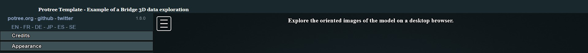

# Potree platfOrm for iNfrastructure Inspection (PONTI)

*Potree platfOrm for iNfrasTructure Inspection* (PONTI) is a custom Potree template for sharing survey products of provincial bridges.

The template is based on the open-source JavaScript library Potree by Markus Schütz.

## About

This template aims to simplify the procedure for building Potree-based platform for bridge survey data sharing.

The repository and template has been defined for implementing the following core features:

* **Pointcloud visualisation** with both RGB and classification appearance;
* **Oriented images on the model** for direct exploration of drone images used for the reconstruction;
* **Annotations definition** to highlight specific bridge elements, possibly embedding multimedia or actions in their descriptions.
* **Database integration** in a fully open source framework


## Getting started

To start, [sign in GitHub](https://github.com/login/) and navigate to the [**PONTI GitHub template**](https://github.com/labmgf-polimi/ponti), where you will see a green Use this template button. Click it to open a new page that will ask you for some details:

* Introduce an appropriate "Repository name".
* Make sure the project is "Public", rather than "Private".

After that, click on the green Create repository from template button, which will generate a new repository on your personal account (or the one of your choosing).

To work locally on the project before loading it to a server, instead click on the Code button and then select the Download ZIP option. After unzipping the downloaded folder, copy everything in the htdocs folder of the xampp directory of your device for working in your local development environment.

This repository is structured as follows:

```
ponti
|
│   assets
    |   [images and samples for README]
    css
    |   style.css
    database
    |   delete_annotation.php
    |   insert_annotation.php
    |   load_annotations.php
    |   update_annotation.php
│   img_selected
    |   chunk1
        |   camera_parameters.xml
        |   oientedimages.txt
        chunk2
        |   camera_P1.txt
        |   camera_P1.xml
    js
    |   annotation.js
    |   orientedcameras.js
    |   pointcloud.js
    libs
    |   [dependencies' libs for Potree]
    licenses
    |   license_brotli.txt
    |   license_json.txt
    |   license_laszip.txt
    |   license_potree_converter.txt
    poinclouds (files not included in GitHub. Folder that needs to be filled with output of pointcloud conversion as follows)
    |   hierarchy.bin
    |   metadata.json
    |   octree.bin
|	index.php
|   LICENSE
|   README.md

```

Important files:

**_README.md_**

Basic description of the repository with instructions on how to replicate the PONTI template.

**_[index.php](https://github.com/Tars4815/ponti/blob/main/index.php)_**

This will be the homepage of the PONTI viewer. It contains the basic settings for the GUI and includes the paths to all the style and js files.

- _CSS_ with the stylesheet in CSS language defined for including in the GUI a header with a description and/or logo.

- _JS_ that includes JavaScript files for loading 3D products in the viewer.

**_img_selected_**

This folder is used to store and collect the oriented images that the viewer developer is willing to integrate on the platform. Together with the picture files, camera certificates and images orientation parameters are saved in this space.

**_libs_**

All libraries' dependencies for making functionable the viewer are saved in the sub-folders.

**_licenses_**

License specifications for the used libraries are descripted here.

**_pointclouds_**

Converted point clouds and ancillary files should be saved in this folder to preserve the template structure.

**_database_**
It contains .php files that allow for the interaction between the platform and a PostgreSQL database. In particular, saving annotations

## **GUI definition** 💻

The [index.html](https://github.com/labmgf-polimi/ponti/blob/main/index.html) file includes the main settings for the web page that contains the custom Potree viewer. For example, information contained in this file defines the **title** that will appear on the browser window when the page is loaded as well as other important **metadata** regarding the content and/or the author(s) of the page. These settings are defined in the first lines in the *head* element:

```
...
<head>
	<meta charset="utf-8">
	<meta name="description" content="Bridge digital twin">
	<meta name="author" content="Federica Gaspari">
	<meta name="viewport" content="width=device-width, initial-scale=1.0, user-scalable=no">
	<title>Bridge name</title>
	<link rel="stylesheet" type="text/css" href="./libs/potree/potree.css">
	<link rel="stylesheet" type="text/css" href="./libs/jquery-ui/jquery-ui.min.css">
	<link rel="stylesheet" type="text/css" href="./libs/openlayers3/ol.css">
	<link rel="stylesheet" type="text/css" href="./libs/spectrum/spectrum.css">
	<link rel="stylesheet" type="text/css" href="./libs/jstree/themes/mixed/style.css">
</head>
...
```
When creating a new custom Potree viewer, change the content description according to your need as well as the content author. Then, change the text between the *title* tag by putting the name and/or location of the surveyed bridge. Leave everything else unchanges.

An additional decoration of the main page consist in a banner on the upper part of the window with a custom text and, optionally, a logo. This element require a simple addition to the HTML and CSS page codes to define its content and appearance.



To style the header banner, in the [assets/css/style.css](https://github.com/labmgf-polimi/ponti/blob/main/assets/css/style.css) file the following CSS code is defined:

```
#header_panel {
    width: 100%;
    height: 5%;
    background-color: #19282C;
}

#header_title {
    color: #FFFFFF;
    font-size: 80%;
    font-weight: bold;
    position: relative;
    left: 100px;
    Top: 20px;
    font-family: Georgia, "Times New Roman", Times, serif;
}
```
The *#* simbol before each name allows to define a specific style for specific div elements (through the so called *id*) in the viewer page definition. In particular:

* **header_panel** is set by default as a dark blue-grey (*background-color*) banner whose *width* is always equal to the entire width of a web page in which the viewer is loaded, while its *height* correspond to the 5% of the web page height.

* **header_title** is by default defining a white bold Georgia text (*color*, *font-weight*, *font-family*) whose position always refers to the div element in which it is contained. 

In the [index.html](https://github.com/labmgf-polimi/ponti/blob/main/index.php) file the previously styled header banner is defined in the body section. To change the title to be displayed on the top of the page, simply change the text included within the div *header_title* element. 

```
<!-- Defining header with title -->
	<div id="header_panel">
		<div id="header_title">
			Ponti Template - Example of a Bridge 3D data exploration
		</div>
	</div>
```
